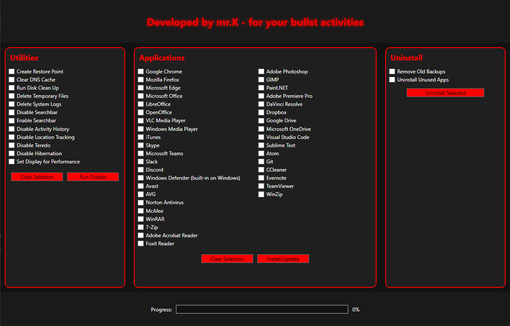

<h2> # Hi there KUPAL! 👋 I'm Mr. K </h2>

Welcome to my GitHub profile! Here’s an overview of my stats and activity.

    <h2>💻 Activities</h2>

    

    

    

    
    <h4>Try my Windows Utility tool</h4>
    
The App Section is currently under development

    
Run PowerShell or CMD as Administrator and copy the code <code>irm tinyurl.com/mrkwinutil | iex</code> and paste it to PS or CMD

    
If you have any Feedback about the utility, let me know

