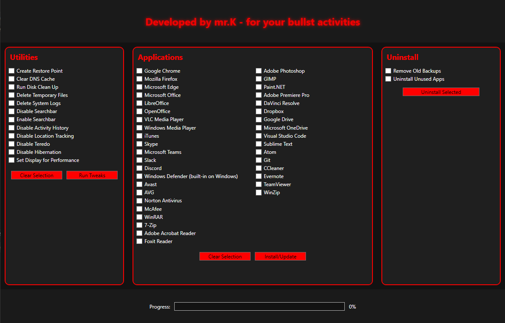

  

    <h2>Hi there KUPAL! 👋</h2>

    <h2>My Portfolio</h2>
    

      <a href="https://markesquivel.page.gd">
        <strong>Check it out »</strong>
      </a>
    

    
Showcasing my projects, skills, and experience

    
Welcome to my GitHub profile! Here’s an overview of my stats and activity.

  

  

    <h2>💻 Activities</h2>
  

  

    
  

  

    
  

  

    <h4>Try my Windows Utility tool</h4>
    
The App Section is currently under development

    

      Run PowerShell or CMD as Administrator and copy the code  
      <code>irm tinyurl.com/mrkwinutil | iex</code>
    

    
If you have any feedback about the utility, let me know

    

    <pre>powershell: irm tinyurl.com/mrkwinutil | iex</pre>
  

